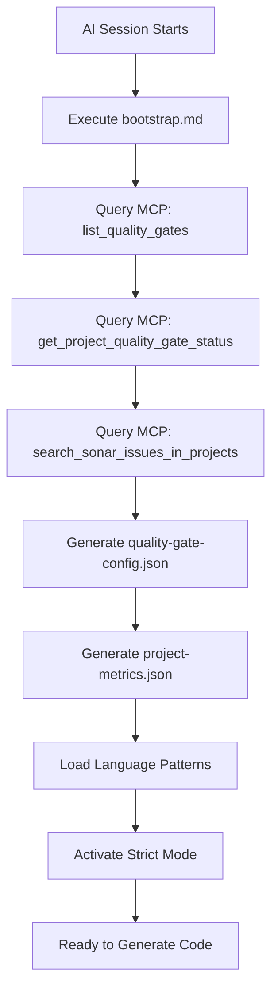

# AI-IDE SonarQube Rules Framework

**Version:** 1.0.0  
**Purpose:** Universal, adaptive AI coding rules that enforce SonarQube quality gates across any IDE

## 🎯 Design Principles

1. **Dynamic Adaptation**: Rules auto-update based on SonarQube MCP server data
2. **IDE Portability**: Works with Cursor, GitHub Copilot, Codeium, etc.
3. **Language Agnostic**: Core principles apply to all languages, with specific adapters
4. **Strict Enforcement**: No compromises on quality gate standards

## 🚀 Quick Start

### For AI Assistants

1. **On Session Start**, execute:
   ```
   .ai-rules/scripts/bootstrap.md
   ```
   This will:
   - Query SonarQube MCP for quality gate configuration
   - Generate dynamic rules based on project settings
   - Load language-specific patterns
   - Activate strict enforcement mode

2. **Before Generating Code**:
   - Check `.ai-rules/dynamic/quality-gate-config.json` for thresholds
   - Apply patterns from `.ai-rules/languages/{language}.md`
   - Follow `.ai-rules/core/sonarqube-principles.md`

3. **After Code Generation**:
   - Validate against dynamic thresholds
   - Query MCP for rule-specific guidance if issues detected

## 📁 Directory Structure

### `/core` - Universal Principles
Static, language-agnostic best practices that never change:
- Code complexity management
- Security fundamentals (OWASP)
- Testing philosophy
- Clean code principles

### `/dynamic` - MCP-Generated Rules
Auto-updated from SonarQube MCP server:
- **quality-gate-config.json**: Current quality gate thresholds
- **project-metrics.json**: Real-time project quality status
- **active-rules.md**: Detailed rule descriptions from MCP

**Refresh Trigger**: Regenerate when:
- Session starts
- User requests with `!refresh-rules`
- Quality gate status changes

### `/languages` - Language-Specific Patterns
Templates for common issues in each language:
- JavaScript/TypeScript: Promise handling, async/await
- Python: List comprehensions, exception handling
- Java: Stream API, null handling
- etc.

### `/ide-adapters` - IDE-Specific Formats
Converted rules for different AI IDEs:
- **Cursor**: `.mdc` files with `alwaysApply: true`
- **GitHub Copilot**: `.github/copilot-instructions.md`
- **Codeium**: `.codeium/rules.json`

## 🔄 How Dynamic Updates Work



## 🎓 For Human Developers

### Installing in Your Project

1. **Copy framework to project**:
   ```bash
   curl -o- https://raw.githubusercontent.com/.../install.sh | bash
   ```

2. **Configure SonarQube MCP Server**:
   Add to your IDE's MCP config (e.g., `~/.cursor/mcp.json`):
   ```json
   {
     "mcpServers": {
       "sonarqube": {
         "command": "npx",
         "args": ["-y", "@sonarqube/mcp-server"]
       }
     }
   }
   ```

3. **Set environment variables**:
   ```bash
   export SONARQUBE_PROJECT_KEY="your-project-key"
   export SONARQUBE_ORG="your-org"
   ```

4. **Initialize**:
   Tell your AI: "Initialize SonarQube rules using `.ai-rules/scripts/bootstrap.md`"

### Adapting to Different IDEs

#### Cursor
Already uses `.mdc` files. Run:
```bash
.ai-rules/scripts/export-to-cursor.sh
```

#### GitHub Copilot
Uses `.github/copilot-instructions.md`. Run:
```bash
.ai-rules/scripts/export-to-copilot.sh
```

#### Codeium
Uses workspace settings. Run:
```bash
.ai-rules/scripts/export-to-codeium.sh
```

## 📊 Quality Gate Enforcement Levels

### Level 1: Permissive (Bronze)
- Coverage ≥ 50%
- Allow minor code smells
- Security/Reliability must be A

### Level 2: Standard (Sonar way)
- Coverage ≥ 80%
- Maintainability A
- Security/Reliability A
- Duplicates ≤ 3%

### Level 3: Strict (Custom)
- Coverage ≥ 90%
- Zero new violations
- Complexity limits
- Custom security rules

**The framework auto-detects your project's quality gate and enforces accordingly.**

## 🔧 Customization

### Adding Custom Rules
Create `.ai-rules/custom/your-rule.md`:
```markdown
---
priority: high
languages: [javascript, typescript]
---

# Your Custom Rule

## When to Apply
[description]

## Pattern
[code example]
```

### Language-Specific Overrides
Edit `.ai-rules/languages/{language}.md` to add project-specific patterns.

## 🤝 Contributing

To make this framework better:
1. Add language patterns to `/languages`
2. Improve MCP query efficiency in `/scripts/bootstrap.md`
3. Create new IDE adapters in `/ide-adapters`

## 📝 License

MIT - Use this framework in any project, commercial or personal.

---

**Maintained by**: SonarSource Community  
**Issues**: https://github.com/your-repo/issues  
**Docs**: https://sonarqube-ai-rules.dev
